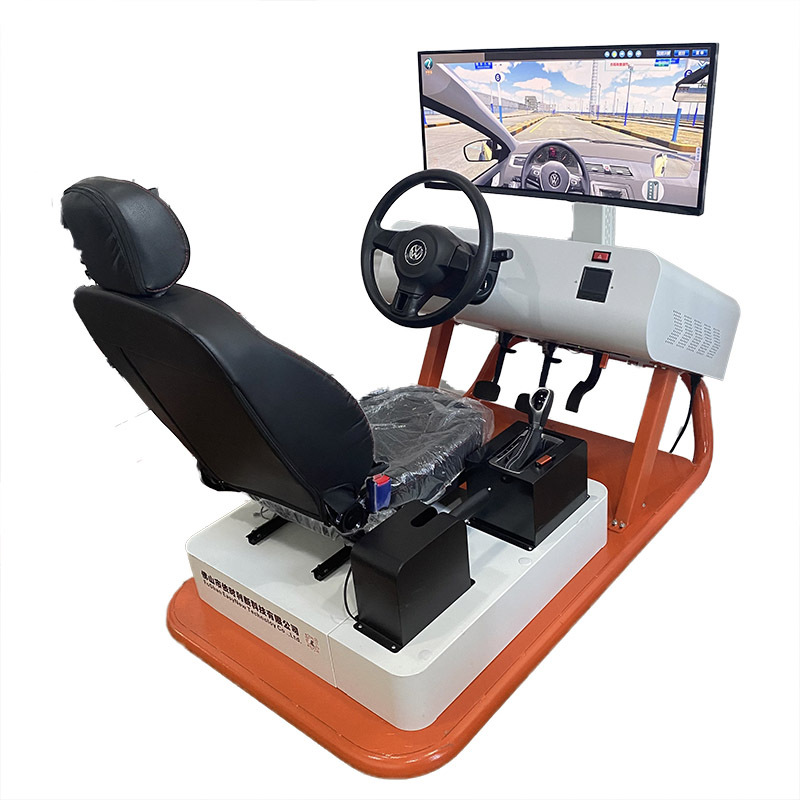
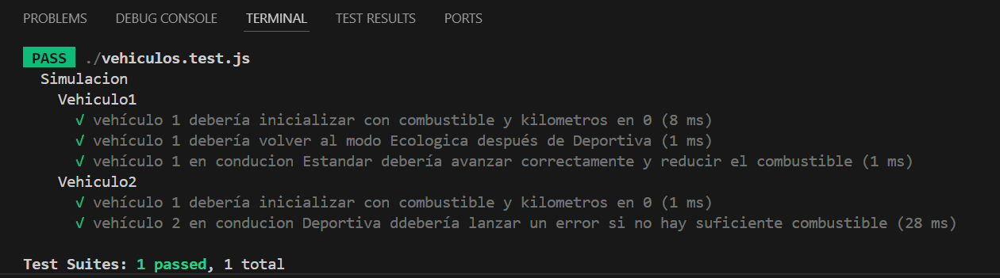

## Simulador de Vehiculos



Se solicita modelar los componentes necesarios para desarrollar una funcionalidad simple de un software de simulación de vehículos.

Los vehículos tienen como atributos:

- Cantidad de combustible (en litros).
- Kilometraje (en kilómetros recorridos).
- Consumo (en kilómetros por litro).
- Velocidad máxima (en km/h).
- Tipo de conducción.

## Tipos de conducción

Por el momento solo existen 3 tipos de conducción pero podría agregarse más si fuera necesario respetando el polimorfismo. Cada tipo de conducción afecta el consumo y la velocidad máxima del auto de la siguiente manera:

- Ecológica: consumo de 16 km/litro y velocidad máxima de 120 km/h.
- Estándar: consumo de 10 km/litro y velocidad máxima de 150 km/h.
- Deportiva: consumo de 5 km/litro y velocidad máxima de 200 km/h.

El vehículo puede cambiar el tipo de conducción, pero únicamente siguiendo la siguiente secuencia:

- De Ecológica a Estándar.
- De Estándar a Deportiva.
- De Deportiva a Ecológica.

## Avance del Vehículo

Los vehículos del simulador siempre arrancan en modo ecológico y con 0 kilometros, pero se les indica la cantidad de combustible en la creación.

La simulación a modelar es avanzar indicandole una cantidad de kilómetros a recorrer. Al avanzar, deben:

- Restar del combustible la cantidad consumida para recorrer la distancia solicitada.
- Sumar los kilómetros recorridos al kilometraje total.
- Si el combustible no es suficiente para recorrer la distancia solicitada, el vehículo avanzará hasta donde le alcance el combustible, actualizará sus atributos correspondientes (combustible y kilometraje) e informará con un error que no pudo completar el recorrido solicitado con el siguiente mensaje: "Combustible insuficiente, solo pude recorrer X del total de Y kilometros.";

Para lanzar un exepción de manera simple y no chequeda pueden hacer

```
    throw new Error("Combustible insuficiente ...")
```

## Test

### 1

1. Crear un vehículo con 25 Litros de combustible.
2. Cambiar una vez el tipo de conducción
3. Avanzar 200 kilómetros
4. Verificar que el auto queden con 200.0 kilomentros y con 5.0 litros de combustible.

### 2

1. Crear un vehículo con 13 Litros de combustible.
2. Cambiar dos veces el tipo de conducción
3. Avanzar 75 kilómetros
4. Verificar que se produjo la RuntimeException "Combustible insuficiente, solo pude recorrer 65 del total de 75.0 kilometros." y que el auto queden con 65.0 kilomentros y con 0.0 litros de combustible.

## Comandos Utiles

Luego de clonarse el repositorio y tenerlo descargado en su disco local, deben posicionar en la carpeta donde clonaron el proyecto

```bash
git clone https://github.com/LabPrograma/simulador_vehiculo.git
cd simulador_vehiculo
```

### Instalar las dependencias.

Lo primero que tiene que hacer es instalar las dependecias del proyecto con el siguiente comando

```bash
npm i
```

### Correr los test

Para correr los test del proyecto

```bash
npm test
```

Deberian tenes una salida similar a la siguiente por la consola


### Correr en modo desarrollo

Para correr el proyecto en mode desarrollo e ir tocando codigo sin detener el programa usar el siguiente comando

```bash
npm run dev
```
